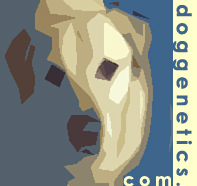
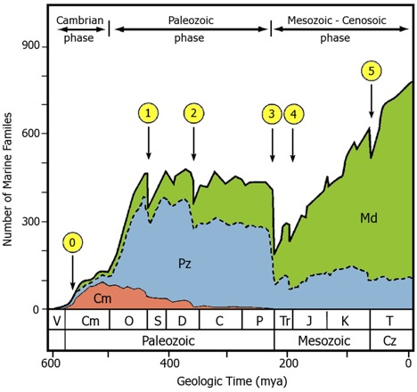

```{r metadata, echo=FALSE}
# creating HTML metadata to accompany the slides
# metathis package documentation: https://pkg.garrickadenbuie.com/metathis/

library(metathis)
meta() %>%  
  meta_general(
    description = "Writing Meaningful Alt-Texts for Data Visualizations in R",
    generator = "xaringan and remark.js"
  ) %>% 
  # GitHub repo housing the slides for the talk
  meta_name("github-repo" = "LizHareDogs/RLadiesNYAltText") %>%
  # metadata for the social card that appears when you share the link on social media
  meta_social(
    title = "R Ladies New York Alt Text Workshop | Liz Hare, PhD",
    url = "https://lizharedogs.github.io/RLadiesNYAltText/index.html",
    image = "coverImageSlide.png",
    image_alt = "",
    og_type = "website",
    og_author = "Liz Hare",
    twitter_card_type = "summary_large_image",
    twitter_creator = "@DogGeneticsLLC"
  )
```

```{r xaringanthemer, echo=FALSE, warning=FALSE}
library(xaringanthemer)

# creating a custom CSS stylesheet using xaringanthemer
# xaringanthemer package documentation: https://pkg.garrickadenbuie.com/xaringanthemer/reference/style_duo_accent_inverse.html

style_duo_accent_inverse(
  primary_color = "#C6B78A",   # gold color from the logo (headers, inverse slides)
  secondary_color = "#C6B78A", # gold color (links and bold words)
  white_color = "#F5F5F5", # off-white color (text)
  black_color = "#14213D", # dark navy blue color (slide background)
  base_font_size = "25px",
  header_h1_font_size = "2.75rem",
  header_h2_font_size = "2.25rem",
  header_h3_font_size = "1.75rem",
  link_decoration = "underline",
  table_row_even_background_color = "#313C54", # lighter navy color
  inverse_link_color = "#14213D", # dark navy blue color
  code_highlight_color = "#ECECCE", # beige color
  header_background_content_padding_top = "5rem",
  footnote_position_bottom = "40px",
  outfile = "css/xaringan-themer.css",
  text_font_family = "Atkinson Hyperlegible",
  text_font_google = google_font("Atkinson Hyperlegible"),
  header_font_google = google_font("Atkinson Hyperlegible"),
  extra_css = list(
    # the following css styles the horizontal bars
    "hr" = list("color" = "#C6B78A",
                "content" = "''",
                "display" = "block",
                "border" = "none",
                "background-color" = "#C6B78A",
                "height" = "0.08em"),
    # the following css styles the list markers to apply the primary color
    "li::marker" = list("content" = "&#8226;",
                        "color" = "#C6B78A"))
)
```

```{r xaringanExtra, echo=FALSE, warning=FALSE}
library(xaringanExtra)

# specifying xaringanExtra features
# xaringanExtra package documentation: https://pkg.garrickadenbuie.com/xaringanExtra/#/?id=xaringanextra

xaringanExtra::use_xaringan_extra(
  c("tile_view",   # enables an overview of the slide deck using letter "O"
    "slide_tone"   # enables audible tone for slide transitions
    )
  ) 
```


```{r setup, include=FALSE, eval = TRUE}
# loading libraries
library(fontawesome)    # icons for use alongside contact info
library(ggplot2)
library(knitr)


# turning off scientific notation
options(scipen = 999)

# setting knitr code chunk options
knitr::opts_chunk$set(collapse = TRUE,
                      fig.retina = 3,
                      cache = FALSE,
                      warning = FALSE,
                      message = FALSE,
                      echo = FALSE,
                      comment = NA,
                      dpi = 300,
                      fig.align = "center")
```


```{r data-import}
## lemurs <- readRDS("data/lemurs.rds")
```

class: bottom, title
background-image: url(img/ben2.jpg)
background-position: 95% 10%
background-size: 200px

<!-- this slide has the Dog Genetics, LLC logo in the top right corner, added using the "background" image classes above. The text begins on the bottom left corner of the slide -->

# `r rmarkdown::metadata$title`
#### `r rmarkdown::metadata$subtitle`
### `r rmarkdown::metadata$author`<br>@DogGeneticsLLC `r fa("twitter", a11y="sem")`

---
class: middle, center




## `r rmarkdown::metadata$author` 

[`r fa("link", a11y="sem")` doggenetics.com](http://doggenetics.com/)<br>
[`r fa("twitter", a11y="sem")` @DogGeneticsLLC](https://twitter.com/DogGeneticsLLC)<br>
[`r fa("github", a11y="sem")` @LizHareDogs](https://github.com/LizHareDogs)<br>
[`r fa("envelope", a11y="sem")` LizHare@DogGenetics.com](mailto:LizHare@DogGenetics.com)


.pull-left[


] <!--end of pull left -->

---

# Today's Topics

- What is alt text?
- Including alt text in R markdown documents
- Two Frameworks for thinking about writing alt text
- Example
- Questions/Practice alt texts


---

# Alt-text: What It Is

- Attached to images to provide a description for people who use screen reading software.
- Required to adhere to accessibility laws
- Crucial to make sure your data communication reaches everyone  

There are blind, low vision, and neurodivergent people in the general population, 
and there are blind members of the data analysis community,
even though we have not been visible.
---

# Alt-text: What It Does

Answers "Why was this image included?"

Examples: 
- It shows the relationship between X and Y in a graph  
- It shows COVID-19 incidences on a map
- It compares four groups on outcome measures in faceted bar charts

---


# Alt-Text: What It Isn't

- **Automatically generated** by AI or text mining
- The title
- The caption
- Axis labels on a graph
- A humorous remark

These will usually not answer these questions:  
- "Why am I including this data visualization?"
- "What are the data saying?"

.footnote[
Humor is allowed, but it shouldn't obscure the message conveyed by the image
]
---

# Where is alt-text?


Started in [HTML code](https://en.wikipedia.org/wiki/Alt_attribute).  

Now appears in places like:  
- [MS Office](https://support.microsoft.com/en-us/office/add-alternative-text-to-a-shape-picture-chart-smartart-graphic-or-other-object-44989b2a-903c-4d9a-b742-6a75b451c669)
- PDFs created with Office
- [PDFs created with Adobe Acrobat](https://csuf.screenstepslive.com/s/12867/m/96806/l/1474315-alt-text-for-images-in-adobe-acrobat-pdf)
- [Twitter posts](https://help.twitter.com/en/using-twitter/picture-descriptions)  
- [Facebook posts](https://www.perkinselearning.org/technology/blog/how-add-alt-text-facebook-page)  
- R markdown [documents](https://bookdown.org/yihui/rmarkdown/) and [slides](https://hugo-academic--silvia.netlify.app/2021-03-16-deploying-xaringan-slides/)

.footnote[
Follow links for instructions
]

---

# Missing Alt-Text Infrastructure?  


.pull-left[
Places without alt-text infrastructure  

- academic journals
- books
- magazines  
- software that helps you create websites and blogs
]

.pull-right[
Workarounds  

- Provide descriptions in text, e.g. describe graphed relationship in Results section of a paper.
- Provide text descriptions of images as supplementary material when submitting to an academic journal.
- Use replies or comments in social media if you've forgotten alt-text
- Provide tables and/or raw data for data visualizations
]

---

# Alt-Text: How Long Is It?

*It depends!*  
- context  
- complexity  

Use your judgemnt even though
- Some media have character limits for alt-text
- Too many guidelines emphasize brevity
- One or two sentences won't be enough for many data visualizations

---

# Alt-Text For Data Visualization: Ingredients Model

Ingredients (answer these questions):
1. What kind of visualization is it (line graph, scatter plot, bar chart...?)
2. What variables are on the axes?
3. What is the range of the data?
4. What relationship between variables does the data visualization show?

Opinion: Don't waste my time with 1-3 if you aren't going to include 4. While some automatic
alt-text processes mine some of this information (e.g. R's ggplot2), I don't want to spend time with the metadata if I can't find out what the graph says.

.footnote[Ingredients identified in this collaboration:  
Canelón S, Hare E. (2021) Revealing room for improvement in accessibility within a social media data visualization learning community. csvConf2021 https://github.com/spcanelon/csvConf2021  
]

# Alt-Text for Data Visualization: MIT Visualization Grou 4-Levels Model

1. Elements and encoded properties  

*title, axes and axis labels, data points*  

2. Statistical and relation information  

*mean, standard deviation, minimum, maximum*  

3. Perceptual and cognitive phenomena  

* "y increases linearly with x," "males spend less time in all behaviors than females for all faceted behaviors," "The following states have high incidences: ... "*

4. Contextual and domain-specific insights  

*"the change in x at this time point was caused by <something not in the data visualization at all>", "the change in incidence was large"*


---

# Link to the Data

Providing a link to the data set and/or an HTML-formatted data table allows the user to explore the data on their own.

Examples:
- COVID-19 incidence map by zip code with a table where the user can look up incidence by zip code
- A line graph accompanied by a data set allows the user to explore statistics like mean, median,
minimum, maximum, slope


Tip: don't put URLs in alt text; there is no way for a screen reader to activate them

---

# Data Visualization Example 1

Dr. Sheffield covering all the ingredients!   

.pull-left[
A graph marking diversity through time.  

X axis: geologic time   

y axis: number of marine families.   

The x axis spans from the Ediacaran to the Tertiary with the periods marked. Eons marked below. The Cambrian phase is marked, ending in Cambrian. Paleozoic phase stretches from Ordovician to Permian. Mesozoic- Cenozoic phase stretches from Triassic to Tertiary.   
]

.pull-right[
Diversity starts low- first big jump occuurs in Cambrian but a larger one occurs during Ordovician. The highest point in the Paleozoic reaches in Ordovician and stays there, except for the 2 major extinctions marked. At the Permian- Triassic, there is a large decrease, and it increases steadily to the end of the graph, except for extinction events.    

Each of the major mass extinctions are marked (5). 0 is marked as an extinction of Ediacaran biota (but there is no decrease in diversity- this is hypothesized, but not clear what occured). 
1: extinction at end of Ordovician. 2: Devonian extinction. 3: Permian extinction. 4: Triassic. 5: Cretaceous.   
]

---

# Data Visualization Example 1 Graph

```{r, diversityTime, fig.alt="A graph marking diversity through time. X axis: geologic time. y axis: number of marine families. The x asix spans from the Ediacaran to the Tertiary with the periods marked. Eons marked below. The Cambrian phase is marked, ending in Cambrian. Paleozoic phase stretches from Ordovician to Permian. Mesozoic- Cenozoic phase stretches from Triassic to Tertiary. Diversity starts low- first big jump occuurs in Cambrian but a larger one occurs during Ordovician. The highest point in the Paleozoic reaches in Ordovician and stays there, except for the 2 major extinctions marked. At the Permian- Triassic, there is a large decrease, and it increases steadily to the end of the graph, except for extinction events.  Each of the major mass extinctions are marked (5). 0 is marked as an extinction of Ediacaran biota (but there is no decrease in diversity- this is hypothesized, but not clear what occured). 1: extinction at end of Ordovician. 2: Devonian extinction. 3: Permian extinction. 4: Triassic. 5: Cretaceous.", out.width="50%"}

```

.footnote[
Sepkoski, J. J. (1978). A kinetic model of Phanerozoic taxonomic diversity I. Analysis of marine orders. Paleobiology, 4(3), 223-251.
]


---

# Objectivity

Report what you perceive about the data without judgement about what they mean.

Don't   
- make assumption about whether values are "good" or "bad" (Jung et al, 2021)  
- express opinions about variables (Jung et al, 2021; Lundgard et al, 2021)
- judge whether a change is small or large (Jung et al, 2021)
- conflate correlation with causation

.footnote[
Jung C, Mehta S, Kulkarni A, Zhao Y, Kim YS. Communicating Visualizations without Visuals: Investigation of Visualization Alternative Text for People with Visual Impairments. IEEE Transactions on Visualization and Computer Graphics. 2021 Sep 30;28(1):1095-105.

Lundgard A, Satyanarayan A. Accessible Visualization via Natural Language Descriptions: A Four-Level Model of Semantic Content. IEEE transactions on visualization and computer graphics. 2021 Sep 30;28(1):1073-83.
]

---


# Alt Text in R Markdown

`fig.alt`is the chunk option that holds your alt textlude one graphic per chunk

```` 
``` {r, altCodeChunk, echo=TRUE, fig.alt = "My Alt Text"}`r ''`
library(knitr)

```
````

You can see examples of including alt text for [these very slides](https:lizharedogs.github.com)

---


# {ggplot2} `alt` and `get_alt_text`

You can also specify alt text for a `ggplot`
using the `labs(alt = <alt-text>)` option.  


```` 
``` {r, plot, echo=TRUE, fig.alt=get_alt_text(p1)}}`r ''`
library(knitr)
library(ggplot2)

p1 <- ggplot(Loblolly, aes(x = age, y = height)) +
    geom_point(na.rm=TRUE) +
    labs(alt = "Scatter plot of tree height and age, X axis is age from 3 to 25 [need to find out units], y axis is height from 3.46 to 64.10 [need to find out units]. Guessing they get taller with age.")

p1
```
````

---

# Retrieve your `ggplot` alt text


`get_alt_text(p1)`

``` {r, gemmaLemmons, fig.alt = "A fuzzy Golden retriever stands in an inside doorway, looking attentively at the photographer.", out.width="20%"}
include_graphics("img/gem.jpg")
```


---

# Include Alt Text in Your Markdown Report

If using a publishing system where alt text isn't available, 
use `get_alt_text()` to pull it into the main text of your document.

.pull-left[
Rmd code:  


`` blah blah blah `r get_alt_text(p1)` blah blah blah ``
]

.pull-left[
Rendered version:  

blah blah blah `r get_alt_text(p1)` blah blah blah
]

---
